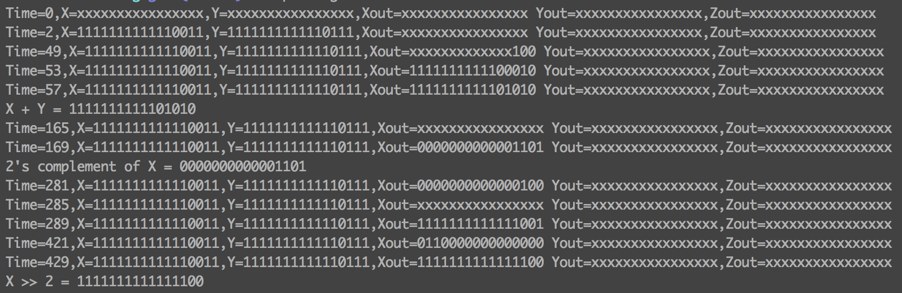
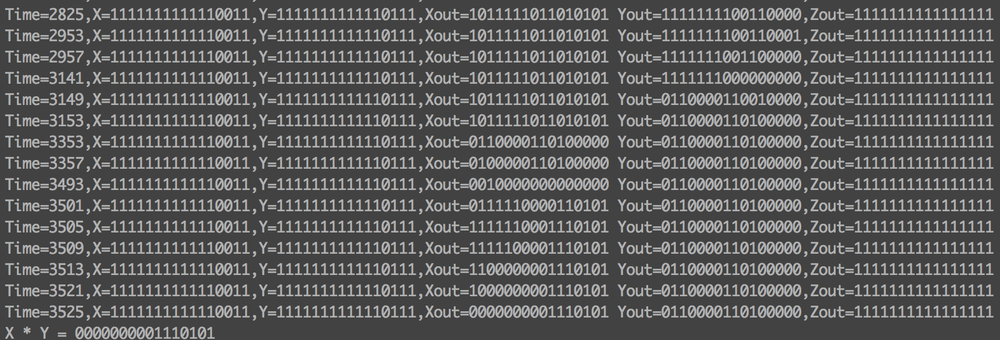

# EE115c Project README

#### Arjun Lakshmipathy
#### Joraaver Chahal

Please read for testing purposes. This is very important

##Layout

The layout is as follows, from top-bottom

1. main.v OR demonstrate.v (explained later)
2. control.v
3. datapath.v
4. ALU.v
5. bitslice.v
6. adder.v/subtractor.v

##Main Module

**Both main.v and demonstrate.v have testbenches, tbMain.v and tbDemonstrate.v** 

For testing purposes, *main.v* should be considered the "main" module. It is left empty (other than connected to our controller), and its testbench merely shows how to multiply two numbers together.

**HOWEVER**

demonstrate.v has a nicer way of demonstrating the correctness of the routines. It has built in tasks for add, multiply, right shift, and two's complement. Those demonstrate basically all the required procedures for this protocol. *All the testbench does is provide you a place to input an X and Y*. For any new X and Y, demonstrate.v reruns all these tasks and outputs the monitor for them as well as the final values in a very human readable form.  Here is an image providing an example. You can always se the original inputs X and Y and what the results for each task are:

**We highly suggest you use demonstrate.v and tbDemonstrate.v first to get a feel for how easy it should be to test that our main functions are working**. 
Only after seeing it run a couple of times, and after having read the section below on how to use our opcodes, should you add stuff to tbMain.v for testing the main fucntion

  
##OP_CODE BREAKDOWN

Passed to the control block is a 12 bit opcode. There are 8 prefix bits and 4 ALU bits.
The meaning of each are as follows

M1  M2  M3  M4  M5  M5  RegOut RegOut ALU ALU ALU ALU

M1 through M5 are the selector bits for each of the 5 MUX's (M5 has two bits for 3 inputs)

RegOut indicates which register (X,Y,Z which correspond to Aout,Bout,Cout in the diagram provided with the spec) to write to (2 bits are needed for 3 outputs)

ALU indicates the 4 bit opcode for the ALU

If the last four bits are an actual operation in the ALU, then the following decoding is used:

1) Observe M3 to choose which register, A or B, to read from.
2) Observe M4 to choose to either read from reg C or from output registers.
3) If M4 is reading from feedback, observe M5 to see which output register to read from.
4) Compute ALU function using ALU opcode, and observe RegOut to see which register to store the data in.

If the last four bits are a datapth operation (Load into A/B/C) then the following decoding is used:

1) Observe opcode. If it is Load A/B, observe M1 to either read X or read from feedback.
2) If M1 indicates to observe from feedback, observe M5 to see which output register to read from.
3) If opcode indicates to Load C, observe M2 to either read Y or read from feedback.
4) If M2 indicates to observe from feedback, observe M5 to see which output register to read from.

For example, if we wanted to first store something from Z into B, the following opcode would handle it (spaced out for convenience):

1  0  0  0  1  0  0      0      1   0   1   1
M1 M2 M3 M4 M5 M5 RegOut RegOut ALU ALU ALU ALU

This means that mux-1 choses to recieve input from feedback. Mux 2-4 we don't care about since the operation doesn't involve them. Mux-5 with 10 means to read from Z. RegOut is 0 0 because we are not writing to any output register. Finally, ALU code 1011 means load into B.

Then, if we want to calculate the bitwise and B with what is currently in Y and store it in Z, the following opcode would handle it:

0  0  1  1  0  1  1      0      0   1   1   0
M1 M2 M3 M4 M5 M5 RegOut RegOut ALU ALU ALU ALU

Mux-1,2 are don't cares. Mux-3 being 1 means to read from register B, and Mux-4 being 1 means to read from feeback (from output registers). Mux-5 being 01 means to read from output register Y, and RegOut of 10 means to write to register Z. ALU opcode 0110 indicates to perform the bitwise & of the two operators. 

That's all there is to it. This same documentation (minus the examples) are in control.v

##Final Notes

1) For the last few Verilog modules, they were developed locally on a Mac using [Icarus Verilog](http://iverilog.icarus.com/). It, for all intensive purposes, should work in ModelSim as well. However, if it doesn't work, please contact Joraaver Chahal, and don't immediately deduct points please. The connection was too slow and becoming a realy pain to work on ModelSim via ssh, and I took the initative to find a local development environment dad the did the trick. Frankly, I think Icarus Verilog does a great, minimalist job for compiling and testing Verilog tools. It dropped support of a synthesis tool, but other open source synthesis tools exist for FPGA's, so that's not a problem.

I won't say this project was fun. It was a huge time commitment that I felt could have been made more manageable. However, as I always, we did learn alot about the full process in terms of laying out the ALU's bitslice and incorporating the extracted delays int o the simulation, so there's always that.
